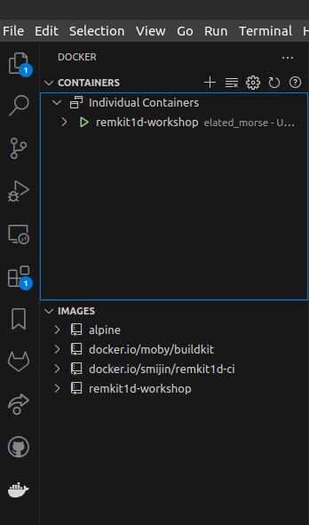
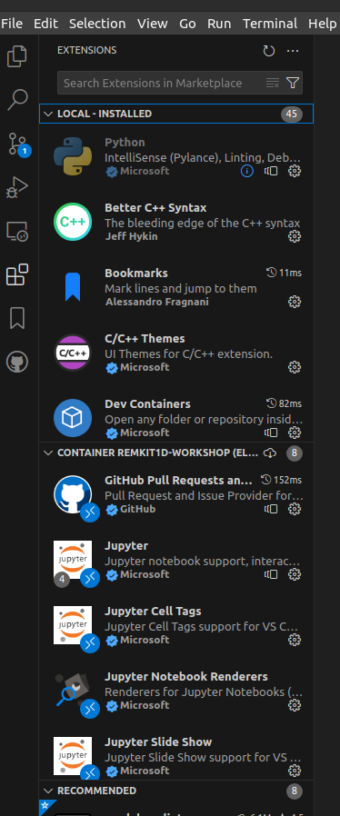
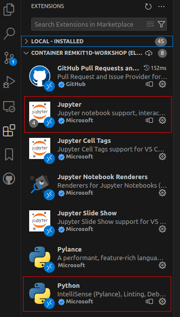
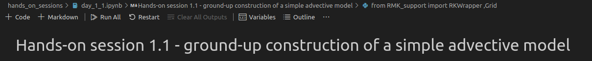

# ReMKiT1D Workshop 2024

This repository will be used for the ReMKiT1D Workshop to be held at UKAEA on 30-31st Jan 2024. It will be updated with the material for the workshop.

## Environment setup instructions 

This workshop assumes basic Python knowledge. Basic knowledge of the following libraries is desirable but not essential:

1. numpy
2. matplotlib
3. xarray
4. holoviews 

A Dockerfile is supplied with this repository containing a prepared environment for running both ReMKiT1D as well as the Python support package. 

[Docker](https://www.docker.com/get-started/) is a prerequisite for this workshop.

Attendees who do not have experience with working within Docker containers are advised to use [VS Code](https://code.visualstudio.com/) as the IDE for this workshop. The remainder of these instructions will assume we are working in VS Code.

After cloning this repository, and opening that folder in VS Code, the user should be prompted to install workspace recommended extensions. These are the Docker and Dev Containers extensions and should be installed before proceeding. 

To build and run the Docker image used in this workshop:

1. Open up the terminal in VS Code (refer to VS Code Keyboard shortcuts for your system: [Windows](https://code.visualstudio.com/shortcuts/keyboard-shortcuts-windows.pdf),[Linux](https://code.visualstudio.com/shortcuts/keyboard-shortcuts-linux.pdf),[macOS](https://code.visualstudio.com/shortcuts/keyboard-shortcuts-macos.pdf))
2. In the terminal run 
```
docker build --tag remkit1d-workshop:latest . 
```

This will start the build process for the Docker image, which can take a while.

3. Once the image is built run the following in order to start the Docker container and to make it visible to the Docker extension

```
docker run -it remkit1d-workshop
```
4. The container will now be running interactively in the terminal. Navigate to the Docker extension in the VS Code sidebar (the bottom icon in the left sidebar in the image below)



5. Under the Containers tab right click on the running remkit1d-workshop container and select `Attach Visual Studio Code` form the right-click menu. This will open a new VS Code window within that container. You might be prompted to open a folder in the container. If so, navigate to the /home directory.

6. In the new VS Code window navigate again to the sidebar, this time to the Extensions menu



7. The Extensions menu will display multiple collapsible sections, including `LOCAL-INSTALLED` and `CONTAINER REMKIT1D-WORKSHOP` (might have a slightly different name depending on your system). 

Make sure that the Python and Jupyter extensions are installed in the container. They should be present as in the below image (you might need to move the collapsible sections around, and the container section will most likely be thin)



If you cannot see the extensions try searching the Extensions Marketplace (the search bar at the top of the Extensions menu). You can find the Python and Jupyter extensions there. To see which extensions are installed again simply clear this search bar.


### Testing the environment 

Once the environment has been set up the following can be done to confirm that the setup was performed correctly:

1. Check that all tests have passed. The outputs of these will be in `/home/ReMKiT1D_build_test.out`,`/home/ReMKiT1D_debug_test.out`,`/home/RMK_support_test.out`.

2. Navigate to `/home/ReMKiT1D-Workshop-2024/hands_on_sessions` using the VS Code Explorer at the top of the left sidebar and open `day_1_1.ipynb` 

3. In the Jupyter menu of the notebook select `Run All`



4. The first time this is done you will be prompted to select a kernel. Select the recommended kernel corresponding to the Python installation in the container (should be 3.8.10)

5. Check that all cells have been executed successfully (have a green checkmark) up to and including the cell below `Create config`. Cells below this require running ReMKiT1D to obtain output and will fail (marked with a red X and displaying error messages).
